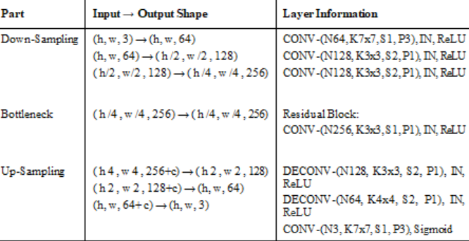

# Many-to-Many Symbolic Multi-track Music Genre Transfer
This the pytorch implementation of StarGAN-based model to realize music style transfer between different musical domains with a single generator.

# Dependencies

* Python 3.6+
* pytorch 1.0
* librosa
* tensorboardX
* scikit-learn
* numpy 1.14.2
* pretty_midi 0.2.8
* pypianoroll 0.1.3

# Usage

## Dataset

Link for Desert Camel MIDI Dataset adapted for  the training and testing of the model: https://drive.google.com/open?id=1QZP1OCTZnAwasmsglbBxXpJs6C8kbT-A

### Train

```
python main.py
```


### Convert


```
python main.py --mode test --test_iters 200000 --src_style bossanova --trg_style "['rock','funk']"
```

# Network Architecture

### Generator




### Discrminator


### Domain Classifier


## [Reference]

[tensorflow StarGAN-VC code](https://github.com/hujinsen/StarGAN-Voice-Conversion)

[pytorch-StarGAN-VC code](https://github.com/liusongxiang/StarGAN-Voice-Conversion)

[StarGAN-VC paper](https://arxiv.org/abs/1806.02169)

[Symbolic Music Genre Transfer with CycleGAN code](https://github.com/sumuzhao/CycleGAN-Music-Style-Transfer.git)

[Symbolic Music Genre Transfer with CycleGAN paper](https://arxiv.org/pdf/1809.07575.pdf)

[MGTGAN paper](http://www.studiomusicatreviso.it/icnmc/library/Paper_63_2019.pdf)

